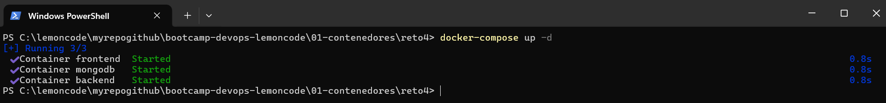
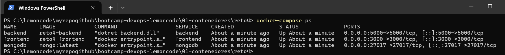
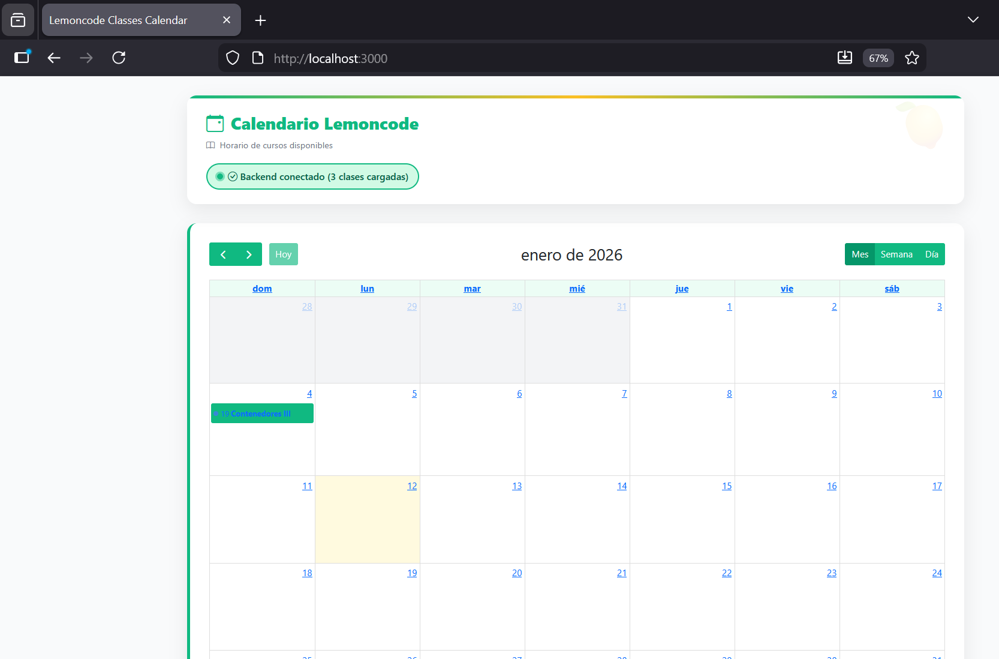

# Reto 4: Docker Compose
## ✅ Archivo compose.yml completo y documentado con comentarios

Puede encontrarse en `compose.yaml`.

    services:
    # MongoDB Database
    mongodb:
        image: mongo:latest       # imagen de MongoDB con etiqueta latest
        container_name: mongodb   # nombre del contenedor
        restart: unless-stopped   # reinicia siempre y cuando no fueran manualmente parados
        ports:
        - "27017:27017"         # mapeamos puertos [host/container]
        env_file: 
        - ".env"                # especificamos variables de entorno en archivo .env y lo cargamos
        volumes:
        - mongo-data:/data/db   # montamos volumen mongo-data en ruta específica para MongoDB
        networks:
        - lemoncode-calendar    # red compartida
        healthcheck:
        # Comando para verificar la salud de MongoDB: ejecuta ping a la base de datos
        test: ["CMD", "mongosh", "--eval", "db.adminCommand('ping')"]
        # Intervalo entre comprobaciones de salud: cada 30 segundos
        interval: 30s
        # Tiempo máximo de espera para la respuesta del comando de healthcheck
        timeout: 10s
        # Número de reintentos antes de marcar el contenedor como no saludable
        retries: 3
        # Período inicial donde el contenedor puede iniciarse sin que se realicen healthchecks
        start_period: 40s

    # Backend .NET API
    backend:
        build:
        context: ./backend      # contexto donde encontramos el dockerfile
        container_name: backend   # nombre del contenedor
        restart: unless-stopped   # reinicia siempre y cuando no fueran manualmente parados
        ports:
        - "5000:5000"           # mapeamos puertos [host/container]
        env_file: 
        - ".env"                # especificamos variables de entorno en archivo .env y lo cargamos
        depends_on:
        mongodb:
            # Especifica que el backend depende de MongoDB y requiere que esté "saludable"
            # Docker esperará a que MongoDB pase sus healthchecks antes de iniciar el backend
            condition: service_healthy
        networks:
        - lemoncode-calendar    # red compartida
        healthcheck:
        # Usa wget para verificar que el endpoint /api/classes responda correctamente
        # --spider: solo verifica la URL sin descargar contenido
        # --no-verbose: muestra menos información
        # --tries=1: solo un intento (Docker maneja los reintentos)
        test: ["CMD", "wget", "--no-verbose", "--tries=1", "--spider", "http://localhost:5000/api/classes"]
        # Intervalo entre comprobaciones de salud: cada 30 segundos
        interval: 30s
        # Tiempo máximo de espera para la respuesta del comando de healthcheck
        timeout: 10s
        # Número de reintentos antes de marcar el contenedor como no saludable
        retries: 3
        # Tiempo inicial donde se permite que la aplicación se inicie sin healthchecks
        # Importante para aplicaciones que tardan en iniciar completamente
        start_period: 40s

    # Frontend Express App
    frontend:
        build:
        context: ./frontend     # contexto donde encontramos el dockerfile
        container_name: frontend  # nombre del contenedor
        restart: unless-stopped   # reinicia siempre y cuando no fueran manualmente parados
        ports:
        - "3000:3000"           # mapeamos puertos [host/container]
        env_file: 
        - ".env"                # especificamos variables de entorno en archivo .env y lo cargamos
        depends_on:
        backend:
            # El frontend depende del backend y requiere que esté "saludable"
            # Docker esperará a que el backend pase sus healthchecks antes de iniciar el frontend
            # Esto evita que el frontend intente conectarse a un backend que no está listo
            condition: service_healthy
        networks:
        - lemoncode-calendar    # red compartida
        healthcheck:
        # Verifica que el servidor frontend en puerto 3000 esté respondiendo
        test: ["CMD", "wget", "--no-verbose", "--tries=1", "--spider", "http://localhost:3000"]
        # Intervalo entre comprobaciones de salud: cada 30 segundos
        interval: 30s
        # Tiempo máximo de espera para la respuesta del comando de healthcheck
        timeout: 10s
        # Número de reintentos antes de marcar el contenedor como no saludable
        retries: 3
        # Tiempo inicial donde se permite que la aplicación se inicie sin healthchecks
        start_period: 40s

    # Red compartida
    networks:
    lemoncode-calendar:
        name: lemoncode-calendar  # nombre de la red
        #external: true            # Reusa una red existente
        driver: bridge          # Sería necesario si no fuera recurso existente

    # Volúmenes para persistencia
    volumes:
    mongo-data:                 # definicion y nombre del volumen
        #external: true            # Reusa un volumen existente y así no perdemos los datos creados anteriormente
        driver: local           # Sería necesario si no fuera recurso existente

## ✅ Archivo .env (si es necesario) con variables de entorno

Puede encontrarse en `.env`.

    # Configuración MongoDB
    MONGO_INITDB_ROOT_USERNAME=admin
    MONGO_INITDB_ROOT_PASSWORD=password
    MONGO_INITDB_DATABASE=LemoncodeCourseDb

    # Configuración Backend .NET
    ASPNETCORE_ENVIRONMENT=Production

    # Configuración Frontend
    API_URL=http://backend:5000/api/classes

## ✅ Comando docker-compose up ejecutándose exitosamente

    docker-compose up -d

## ✅ Captura de pantalla de todos los servicios corriendo (docker-compose ps)

    docker-compose ps

## ✅ Captura de pantalla de la aplicación completa en http://localhost:3000

