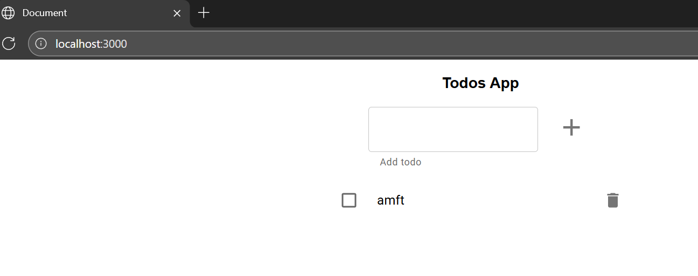
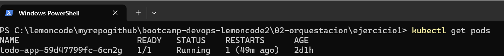
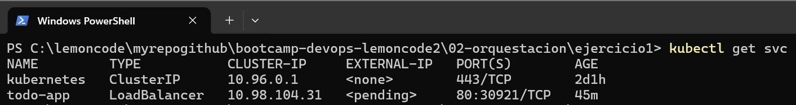
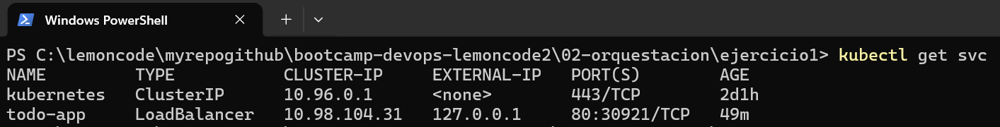
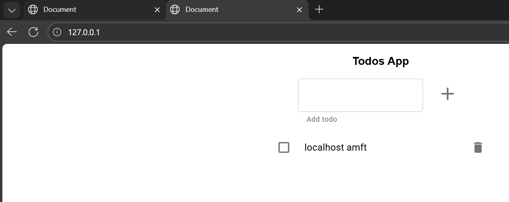

# Monolito en memoria

El objetivo del ejercicio es desplegar la aplicación todo-app (monolito en memoria) en un clúster Kubernetes local usando Minikube, exponiéndola al exterior mediante un `Service` de tipo `LoadBalancer` y accediendo a ella a través del navegador utilizando `minikube tunnel`.

## 1. Construcción de la imagen
Lo primero es crear la imagen de `todo-app` en local tal usando

    docker build -t jaimesalas/lc-todo-monolith . 
    docker images

Ahora podemos probar que la imagen funciona creando un contenedor con 

    docker run -d -p 3000:3000 -e NODE_ENV=production -e PORT=3000 jaimesalas/lc-todo-monolith

Accedemos a `localhost:3000` y la tenemos

## 2. Carga de la imagen en Minikube

Una vez construida la imagen, debemos cargarla a Minikube, si no no será accesible.

    minikube image load jaimesalas/lc-todo-monolith:latest

## 3. Creación del Deployment

Puede consultarse en `todo-app-deployment.yaml`.

Aplicamos el Deployment con 

    kubectl apply -f todo-app-deployment.yaml

Y ahora podemos verificar el que el pod se ha creado correctamente

    kubectl get pods

## 4. Exposición mediante LoadBalancer

La idea ahora es exponer el deployment mediante un `Service` de tipo `LoadBalancer` para simular una publicación externa.

El `service` puede consultarse en `todo-app-service.yaml`

Aplicamos el `service`

    kubectl apply -f todo-app-service.yaml

Y comprobamos que se creó correctamente

    kubectl get svc

Inicialmente la columna EXTERNAL-IP aparece como `pending` porque Minikube **no** tiene soporte nativo de `LoadBalancers`.

## 5. Activación del túnel

Para simular el comportamiento de un `LoadBalancer` real debemos ir a otro powershell y ejecutar

    minikube tunnel

Con esto conseguimos que se le asigne una `EXTERNAL-IP` al `service`, en este caso `127.0.0.1`

## 6. Acceso desde navegador

Por último adjuntamos una captura del navegador accediendo a la IP externa asignada.

Si paramos el proceso del túnel podemos comprobar que ya no tenemos acceso a lo anterior.